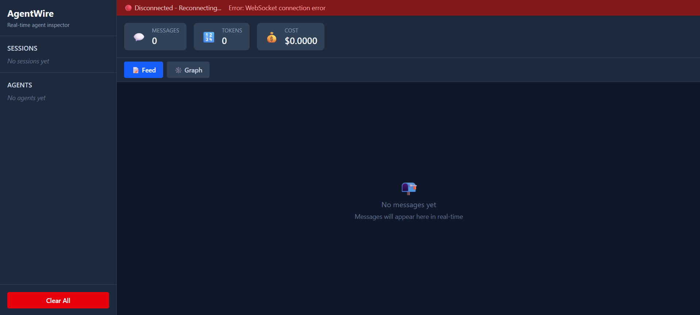

<div align="center">

# 🔌 AgentWire

### Real-time message bus and inspector for multi-agent LLM systems

[](https://www.python.org/downloads/)
[](https://opensource.org/licenses/MIT)
[](tests/)
[](https://github.com/psf/black)

[Features](#-features) • [Quick Start](#-quick-start) • [Examples](#-examples) • [Documentation](#-documentation) • [Integrations](#-integrations)



*Make the invisible visible. See every message, every agent, every decision.*

</div>

---

## 🎯 The Problem

Multi-agent systems are **opaque black boxes**. When your 5-agent pipeline produces a bad result, you have no way to see:
- Which agent said what to whom
- Why things went wrong
- Where the breakdown happened
- How much it cost

**Debugging is impossible. Optimization is guesswork.**

## ✨ The Solution

```python
pip install agentwire
agentwire start

# Wrap your agents (one line each)
researcher = aw.wrap(ResearchAgent(), name="researcher")
writer = aw.wrap(WriterAgent(), name="writer")

# Run your pipeline
with aw.session("blog-post-run"):
    facts = researcher.run("Find quantum computing breakthroughs")
    post = writer.run(facts)
```

**Open http://localhost:7433 → See everything in real-time.**

---

## 🚀 Features

<table>
<tr>
<td width="50%">

### 📊 Real-Time Message Feed
See messages flowing between agents as they happen. Every TASK, RESULT, ERROR, and TOOL_CALL is captured and displayed with full context.

</td>
<td width="50%">

### 🕸️ Interactive Graph View
Visualize agent topology with D3 force-directed graphs. Node size = message count, edge width = message frequency. Click to filter.

</td>
</tr>
<tr>
<td width="50%">

### ⏮️ Session Replay
Step through past runs message-by-message. Progressive graph rendering shows how your system evolved. Speed control: 0.5× to 10×.

</td>
<td width="50%">

### 💰 Cost Tracking
Automatic token counting and USD cost calculation for Claude, GPT-4, Gemini, and more. See exactly what each agent costs.

</td>
</tr>
<tr>
<td width="50%">

### 🔌 Framework-Agnostic
Works with **LangChain**, **AutoGen**, **CrewAI**, and raw API calls. One unified view across all frameworks in the same session.

</td>
<td width="50%">

### 🚀 Zero Infrastructure
SQLite by default. No Docker, no Postgres, no signup required. `pip install && agentwire start` and you're done.

</td>
</tr>
</table>

---

## ⚡ Quick Start

### Installation

```bash
pip install agentwire
```

### Start the Server

```bash
agentwire start
```

This starts:
- 🌐 REST API at `http://localhost:7433/api`
- 🔌 WebSocket at `ws://localhost:7433/ws`
- 📊 Dashboard at `http://localhost:7433`

### Wrap Your Agents

```python
import agentwire as aw

# Configure once
aw.configure(bus_url="http://localhost:7433")

# Wrap any agent (works with any class)
researcher = aw.wrap(ResearchAgent(), name="researcher")
writer = aw.wrap(WriterAgent(), name="writer")
reviewer = aw.wrap(ReviewerAgent(), name="reviewer")

# Run with session grouping
with aw.session("blog-post-run-42", name="Blog Post Generation"):
    facts = researcher.run("Find quantum computing breakthroughs")
    draft = writer.run(facts)
    final = reviewer.run(draft)
```

### View in Dashboard

Open **http://localhost:7433** to see:

- **📝 Feed View** - Real-time message stream with auto-scroll
- **🕸️ Graph View** - Agent topology with interactive nodes
- **📊 Stats** - Messages, tokens, cost tracking
- **⏮️ Replay** - Step through session with timeline controls

---

## 🎨 What Makes It Different

<table>
<tr>
<th>Feature</th>
<th>AgentWire</th>
<th>LangSmith</th>
<th>Langfuse</th>
<th>Phoenix</th>
</tr>
<tr>
<td><strong>Traces inter-agent messages</strong></td>
<td>✅</td>
<td>❌</td>
<td>❌</td>
<td>❌</td>
</tr>
<tr>
<td><strong>Framework-agnostic</strong></td>
<td>✅</td>
<td>❌</td>
<td>Partial</td>
<td>Partial</td>
</tr>
<tr>
<td><strong>Session replay</strong></td>
<td>✅</td>
<td>❌</td>
<td>❌</td>
<td>❌</td>
</tr>
<tr>
<td><strong>Zero infrastructure</strong></td>
<td>✅</td>
<td>❌</td>
<td>❌</td>
<td>❌</td>
</tr>
<tr>
<td><strong>Open source</strong></td>
<td>✅</td>
<td>❌</td>
<td>✅</td>
<td>✅</td>
</tr>
<tr>
<td><strong>Real-time graph</strong></td>
<td>✅</td>
<td>❌</td>
<td>❌</td>
<td>Partial</td>
</tr>
</table>

**AgentWire focuses on the message bus abstraction** - what agents say to each other - not just LLM calls.

---

## 📚 Examples

### LangChain Research Pipeline

```python
from agentwire.integrations.langchain import AgentWireCallback
import agentwire as aw

aw.configure(bus_url="http://localhost:7433")

with aw.session("research-run"):
    planner = aw.wrap(PlannerAgent(), name="planner")
    researcher = aw.wrap(ResearchAgent(), name="researcher")
    summarizer = aw.wrap(SummarizerAgent(), name="summarizer")
    
    plan = planner.run("Quantum computing breakthroughs 2024")
    findings = researcher.run(plan)
    summary = summarizer.run(findings)
```

[→ See full example](examples/langchain_research/)

### AutoGen Coding Team

```python
from agentwire.integrations.autogen import wire_autogen_agent
import agentwire as aw

with aw.session("coding-session"):
    orchestrator = aw.wrap(OrchestratorAgent(), name="orchestrator")
    coder = aw.wrap(CoderAgent(), name="coder")
    reviewer = aw.wrap(ReviewerAgent(), name="reviewer")
    
    assignment = orchestrator.run("Write Fibonacci function")
    code = coder.run(assignment)
    review = reviewer.run(code)
```

[→ See full example](examples/autogen_coding_team/)

### Raw API Pipeline

```python
import agentwire as aw

with aw.session("data-pipeline"):
    fetcher = aw.wrap(DataFetcher(), name="fetcher")
    processor = aw.wrap(DataProcessor(), name="processor")
    analyzer = aw.wrap(DataAnalyzer(), name="analyzer")
    reporter = aw.wrap(Reporter(), name="reporter")
    
    data = fetcher.run("production-db")
    processed = processor.run(data)
    analysis = analyzer.run(processed)
    report = reporter.run(analysis)
```

[→ See full example](examples/raw_api_pipeline/)

---

## 🔧 Integrations

### LangChain

```python
from agentwire.integrations.langchain import AgentWireCallback

agent = initialize_agent(
    tools=[...],
    llm=llm,
    callbacks=[AgentWireCallback(agent_name="researcher")]
)
```

### AutoGen

```python
from agentwire.integrations.autogen import wire_autogen_agent

wire_autogen_agent(my_agent, name="assistant", session_id="run-1")
```

### CrewAI

```python
from agentwire.integrations.crewai import wire_crew

my_crew = Crew(agents=[...], tasks=[...])
wire_crew(my_crew, session_id="crew-run")
result = my_crew.kickoff()
```

---

## 🎮 CLI Commands

```bash
# Start server
agentwire start                    # Default: port 7433
agentwire start --port 8000        # Custom port
agentwire start --no-dashboard     # API-only mode

# Check status
agentwire status                   # Show server status and stats

# Clear data
agentwire clear                    # Clear all (with confirmation)
agentwire clear --session abc123   # Clear specific session
agentwire clear --force            # Skip confirmation

# Stop server
agentwire stop

# Docker
agentwire docker up                # Start with Docker Compose
agentwire docker down              # Stop containers
```

---

## 📖 Documentation

- **[Quick Start Guide](docs/quickstart.md)** - Get started in 5 minutes
- **[API Reference](docs/api-reference.md)** - Complete REST & WebSocket API
- **[SDK Documentation](docs/sdk/overview.md)** - Python SDK reference
- **[Integration Guides](docs/integrations/langchain.md)** - Framework integrations
- **[Dashboard Guide](docs/dashboard/overview.md)** - Using the web interface
- **[Examples](examples/)** - Working code examples

---

## 🏗️ Architecture

```
┌─────────────────┐
│   Agent Code    │  Your Python code
│   (SDK)         │  aw.wrap(), aw.session()
└────────┬────────┘
         │ emit()
         ↓
┌─────────────────┐
│   REST API      │  FastAPI server
│   POST /api/    │  Store + broadcast
└────────┬────────┘
         │
    ┌────┴────┐
    ↓         ↓
┌────────┐ ┌──────────┐
│ SQLite │ │WebSocket │  Real-time
│  DB    │ │Broadcast │  to clients
└────────┘ └─────┬────┘
                 ↓
         ┌───────────────┐
         │ React         │  Dashboard
         │ Dashboard     │  Feed + Graph
         └───────────────┘
```

---

## 🧪 Testing

```bash
# Run all tests (54 passing)
pytest tests/ -v

# Run specific test suite
pytest tests/test_bus.py -v
pytest tests/test_integrations.py -v

# Run with coverage
pytest tests/ --cov=agentwire --cov-report=html
```

---

## 🛠️ Development

### Setup

```bash
# Clone repository
git clone https://github.com/DanixMP/AgentWire.git
cd agentwire

# Install in development mode
pip install -e .
pip install -r requirements-dev.txt

# Run tests
pytest tests/

# Start dashboard dev server
cd dashboard
npm install
npm run dev
```

### Project Structure

```
agentwire/
├── agentwire/              # Python package
│   ├── models.py           # Data models
│   ├── store.py            # Database layer
│   ├── bus.py              # FastAPI server
│   ├── emitter.py          # Message emission
│   ├── wrapper.py          # Agent wrapping
│   ├── session.py          # Session management
│   ├── cli.py              # CLI tool
│   └── integrations/       # Framework integrations
├── dashboard/              # React dashboard
│   └── src/
│       ├── components/     # React components
│       ├── hooks/          # Custom hooks
│       └── types.ts        # TypeScript types
├── examples/               # Example scripts
├── tests/                  # Test suite
└── docs/                   # Documentation
```

---

## 🎯 Roadmap

### ✅ Completed
- Core message bus and storage
- Real-time WebSocket broadcasting
- React dashboard with feed and graph
- Session replay with timeline
- CLI tool
- Framework integrations (LangChain, AutoGen, CrewAI)
- Examples and documentation

### 🚧 Planned
- [ ] Postgres support for production
- [ ] Multi-session comparison
- [ ] Export sessions as JSON/CSV
- [ ] Custom message types
- [ ] Webhook notifications
- [ ] Team collaboration features
- [ ] Cloud deployment guides

---

## 🤝 Contributing

Contributions are welcome! Please feel free to submit a Pull Request.

1. Fork the repository
2. Create your feature branch (`git checkout -b feature/amazing-feature`)
3. Commit your changes (`git commit -m 'Add amazing feature'`)
4. Push to the branch (`git push origin feature/amazing-feature`)
5. Open a Pull Request

---

## 📄 License

MIT License - see [LICENSE](LICENSE) file for details.

---

## 🙏 Acknowledgments

- Built with [FastAPI](https://fastapi.tiangolo.com/), [React](https://react.dev/), and [D3.js](https://d3js.org/)
- Inspired by the need for better multi-agent observability
- Thanks to the LangChain, AutoGen, and CrewAI communities

---

## 📞 Support

- 📖 [Documentation](https://github.com/DanixMP/AgentWire/tree/main/docs)
- 💬 [GitHub Issues](https://github.com/DanixMP/AgentWire/issues)
- 📧 [Email](mailto:mahdipur97@gmail.com)

---

<div align="center">

**Made with ❤️ for the multi-agent AI community**

[⭐ Star us on GitHub](https://github.com/DanixMP/AgentWire) • [🐦 Follow on Twitter](https://twitter.com/DanixMP)

</div>
